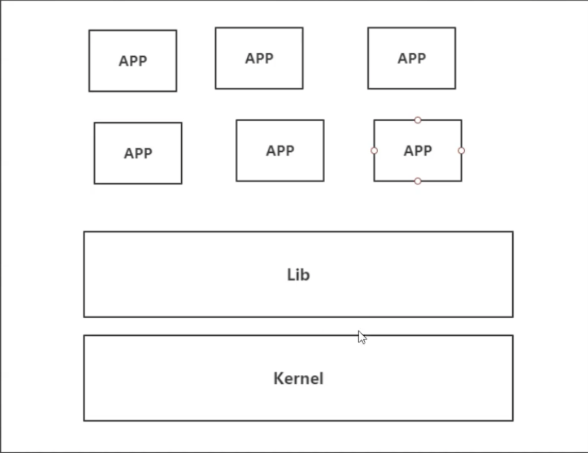
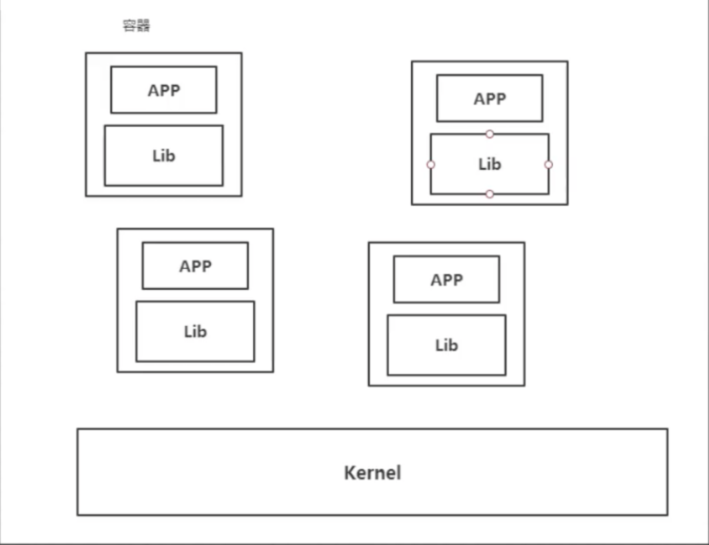

# Docker能做什么

## 之前的虚拟机技术

### 虚拟机技术缺点

- 1、资源占用十分多
- 2、冗余步骤多
- 3、启动很慢

## 容器化技术

- 容器化技术不是模仿一个完整的操作系统

## 比较docker和虚拟机技术的不同

- 传统虚拟机,虚拟出一条硬件,运行一个完整的OS,然后在这个OS上面做各种操作
- 容器内的应用直接运行在宿主机的内容,容器是没有自己的内核的,也没有虚拟机的硬件,所以就轻便了
- 每个容器是相互隔离,每个容器都有一个属于自己的文件系统,互不影响。

## DevOps(开发、运维)

    ##     应用更快速的交付与部署         

- 传统:一堆帮助文档,安装程序

- Docker：打包镜像,发布测试,一键运行

  ## 更便捷的升级与扩缩容

  - 使用Docker之后,我们部署应用就和搭积木一样!,项目打包成一个image
  - 项目打包成一个image,扩展,服务A ...

## 更简单的系统运维

- 开发与测试环境高度一致

## 更高效的利用计算资源

- Docker是内个级别的虚拟化,可以在一个物理机上面运行很多容器实例!服务器的性能资可以被压榨到极致

