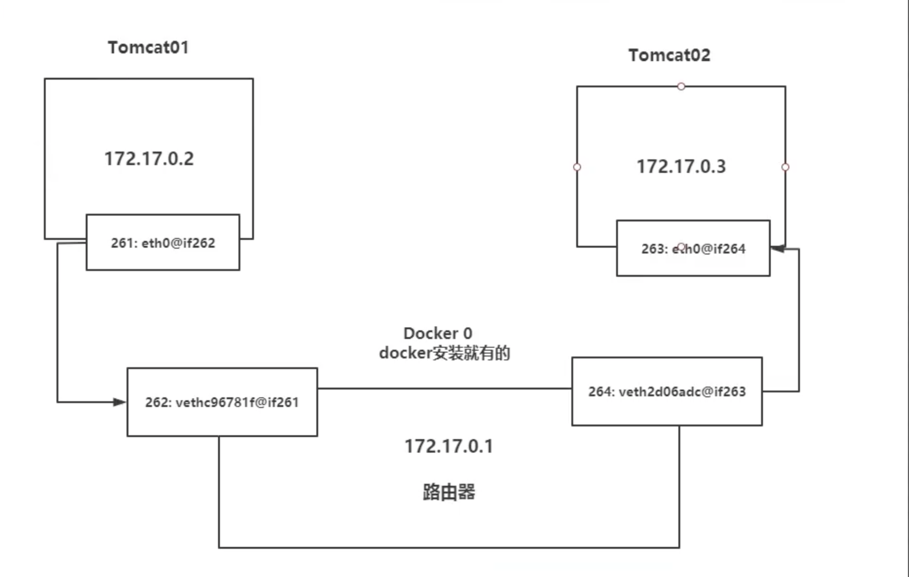
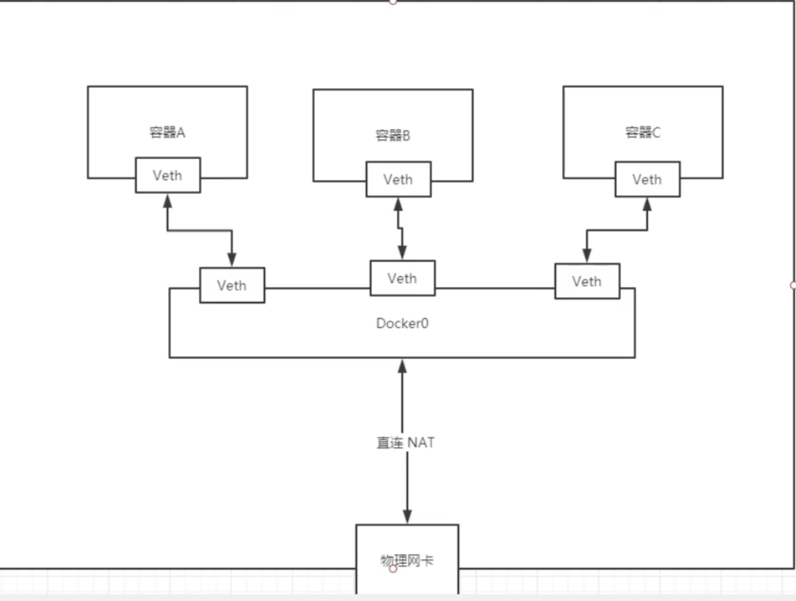

# Docker网络

## 理解Docker网络:Docker0

 ```
 docker rmi -f $(docker ps -aq)
 ```

```shell
ip a | grep docker 0

[root@ksc-epc ~]# ip a | grep docker0
8: docker0: <BROADCAST,MULTICAST,UP,LOWER_UP> mtu 1500 qdisc noqueue state UP group default
    inet 172.17.0.1/16 brd 172.17.255.255 scope global docker0
42: veth9deca60@if41: <BROADCAST,MULTICAST,UP,LOWER_UP> mtu 1500 qdisc noqueue master docker0 state UP group default


说明:在172.17网段 子网掩码简写16


[root@ksc-epc ~]# docker pull tomcat
[root@ksc-epc ~]# docker run  -d -P  --name=tomcat01 tomcat 

[root@ksc-epc ~]# docker exec -it tomcat01 ip a
1: lo: <LOOPBACK,UP,LOWER_UP> mtu 65536 qdisc noqueue state UNKNOWN group default qlen 1000
    link/loopback 00:00:00:00:00:00 brd 00:00:00:00:00:00
    inet 127.0.0.1/8 scope host lo
       valid_lft forever preferred_lft forever
41: eth0@if42: <BROADCAST,MULTICAST,UP,LOWER_UP> mtu 1500 qdisc noqueue state UP group default
    link/ether 02:42:ac:11:00:02 brd ff:ff:ff:ff:ff:ff link-netnsid 0
    inet 172.17.0.2/16 brd 172.17.255.255 scope global eth0
       valid_lft forever preferred_lft forever
       
  
 新创建的容器IP为 172.17.0.2 与docker0 网卡同一网段 所以容器内部与宿主机(容器的创建者是可以网络连通的)
  

```

```SHELL
我们每启动一个docker container ,docker就会给container分配一个IP,我们只要安装了一个docker服务,就会有一个docker0虚拟网卡,并使用桥接模式，使用的技术为veth-pair
```

```
刚刚我们创建了一个container
container内部网络为:
41: eth0@if42: <BROADCAST,MULTICAST,UP,LOWER_UP> mtu 1500 qdisc noqueue state UP group default
    link/ether 02:42:ac:11:00:02 brd ff:ff:ff:ff:ff:ff link-netnsid 0
    inet 172.17.0.2/16 brd 172.17.255.255 scope global eth0
       valid_lft forever preferred_lft forever

对应的host的网络为:
42: veth9deca60@if41: <BROADCAST,MULTICAST,UP,LOWER_UP> mtu 1500 qdisc noqueue master docker0 state UP group default

两个网卡都是使用veth-pair技术虚拟出的网卡:veth***

```

```shell
此时我们再次创建一个容器
# docker run -d -P --name=tomcat02  tomcat:net
# docker exec -it tomcat02 ip a

1: lo: <LOOPBACK,UP,LOWER_UP> mtu 65536 qdisc noqueue state UNKNOWN group default qlen 1000
    link/loopback 00:00:00:00:00:00 brd 00:00:00:00:00:00
    inet 127.0.0.1/8 scope host lo
       valid_lft forever preferred_lft forever
47: eth0@if48: <BROADCAST,MULTICAST,UP,LOWER_UP> mtu 1500 qdisc noqueue state UP group default
    link/ether 02:42:ac:11:00:03 brd ff:ff:ff:ff:ff:ff link-netnsid 0
    inet 172.17.0.3/16 brd 172.17.255.255 scope global eth0
       valid_lft forever preferred_lft forever

```

```shell
# 我们发现这个容器创建后到来的网卡，都是成对的
# veth-pair技术就是一堆虚拟的设备接口,他们都是成对出现的,一段连着协议,一段连着彼此
# 正因为有了这个特性,veth-pair充当了一个桥梁,链接各种虚拟网络设备的
# OpenStack ,Docker容器之间的链接,OVS技术,都是使用了veth-pair技术
```

```shell
此时我们使用tomcat01去ping tomcat02的IP
docker exec -it tomcat01 ping 172.17.0.3

[root@ksc-epc ~]# docker exec -it tomcat01 ping 172.17.0.3
PING 172.17.0.3 (172.17.0.3): 56 data bytes
64 bytes from 172.17.0.3: icmp_seq=0 ttl=64 time=0.171 ms
64 bytes from 172.17.0.3: icmp_seq=1 ttl=64 time=0.036 ms
64 bytes from 172.17.0.3: icmp_seq=2 ttl=64 time=0.034 ms
```



```shell
# 结论,所有容器在不指定网络的情况下，都是使用docker0这个网络作为路由的
# 默认情况下docker会根据docker0网络给新创建的container分配IP
```



```shell
# 核心:使用了Linux网卡技术,使用虚拟网卡技术,节省硬件资源,而且带宽高
```

```shell
# 删除container之后,使用veth-pair技术分配的两个成对的虚拟网口会被删除
```

