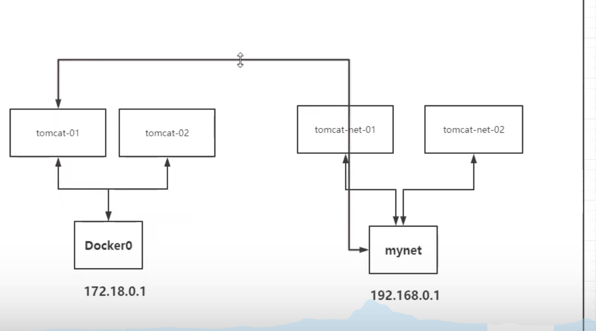

# 网络连通



```SHELL
[root@ksc-epc ~]# docker network --help

Usage:  docker network COMMAND

Manage networks

Commands:
  connect     Connect a container to a network
  create      Create a network
  disconnect  Disconnect a container from a network
  inspect     Display detailed information on one or more networks
  ls          List networks
  prune       Remove all unused networks
  rm          Remove one or more networks
```

```SHELL
[root@ksc-epc ~]# docker network connect --help

Usage:  docker network connect [OPTIONS] NETWORK CONTAINER

Connect a container to a network

Options:
      --alias strings           Add network-scoped alias for the container
      --driver-opt strings      driver options for the network
      --ip string               IPv4 address (e.g., 172.30.100.104)
      --ip6 string              IPv6 address (e.g., 2001:db8::33)
      --link list               Add link to another container
      --link-local-ip strings   Add a link-local address for the container
```

### 使用不同网络的container的通信方式:我们可以使用docker network connet network container

```SHELL
# 之前我们使用了bridge网络创建了tomcat01-bridge 使用mydockernet创建了tomcat01

他们处于不同的网络环境中 不能通信，但是当时想让他俩通信 可以将tomcat01-bridge加入到tomcat01 所在的网络中
# docker network connect mydockernet tomcat01-bridge

# 现在可以详细的看一下mydockernet网络的情况

[
    {
        "Name": "mydockernet",
        "Id": "34c79542e04f06489e25a267aaebfc77357730115f2cd31549053f0e7e2e0454",
        "Created": "2022-03-21T11:35:43.80740179+08:00",
        "Scope": "local",
        "Driver": "bridge",
        "EnableIPv6": false,
        "IPAM": {
            "Driver": "default",
            "Options": {},
            "Config": [
                {
                    "Subnet": "192.168.0.0/16",
                    "Gateway": "192.168.0.1"
                }
            ]
        },
        "Internal": false,
        "Attachable": false,
        "Ingress": false,
        "ConfigFrom": {
            "Network": ""
        },
        "ConfigOnly": false,
        "Containers": {
            "bd0db153359b5128964fd404cbf79f200b235600682cc5304d38570f23fee2cc": {
                "Name": "tomcat02",
                "EndpointID": "a3806d7e441e4dcef4688e3d729b4291667f51882e929e62fa8e36a36d7b5857",
                "MacAddress": "02:42:c0:a8:00:03",
                "IPv4Address": "192.168.0.3/16",
                "IPv6Address": ""
            },
            "c25f2f5b705b8a5677f0665930d3db74ad97bc8b2dbb29b27157666f76fa463f": {
                "Name": "tomcat01-bridge",
                "EndpointID": "8b38d89e18b54a8744ee56f6a3e6881c9eedf5b62cea8cf1e0e4693d63bc4112",
                "MacAddress": "02:42:c0:a8:00:04",
                "IPv4Address": "192.168.0.4/16",
                "IPv6Address": ""
            },
            "d798290ad69959a9d3addb383efd442aebcbaeeed4629536fb283661c5992e37": {
                "Name": "tomcat01",
                "EndpointID": "1e4f21a0e585eb92156b26a4271efee0e23d369cc9b1fd1ffd0f68d5d35403e2",
                "MacAddress": "02:42:c0:a8:00:02",
                "IPv4Address": "192.168.0.2/16",
                "IPv6Address": ""
            }
        },
        "Options": {},
        "Labels": {}
    }
]

# 发现已经将tomcat01-bridge网络加入到了mydockernet网络中,
# 但是tomcat:01-bridge所在的原网络bridge依然保留一份
# 此时tomcat:01-bridge ip a后会有两个veth-pair技术分配的IP


```


