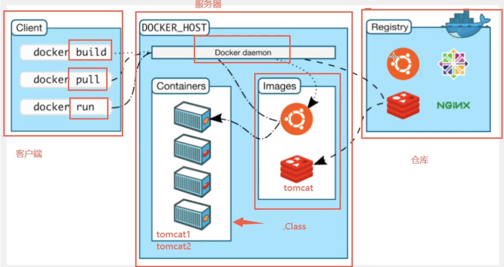

# Docker基本名词

  

## 镜像(image)

docker镜像就好比一个抽象模板，可以通过模板创建实例服务,通过这个镜像可以创建多个容器(最终的服务、项目运行在container中)

## 容器(container)

镜像的实例化,可以启动,停止，删除

目前可以理解为简易的Linux操作系统

## 仓库(repo)

存放image的地方

分为公有和私有(概念月github类似)

官方:Dockerhub(默认是国外的)

阿里云等等都有container服务(配置镜像加速)

