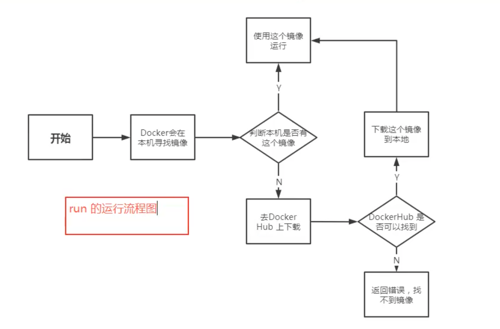
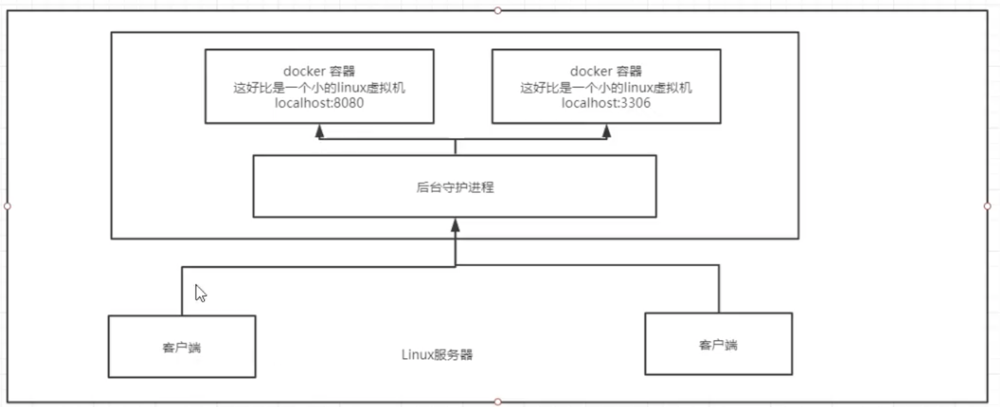
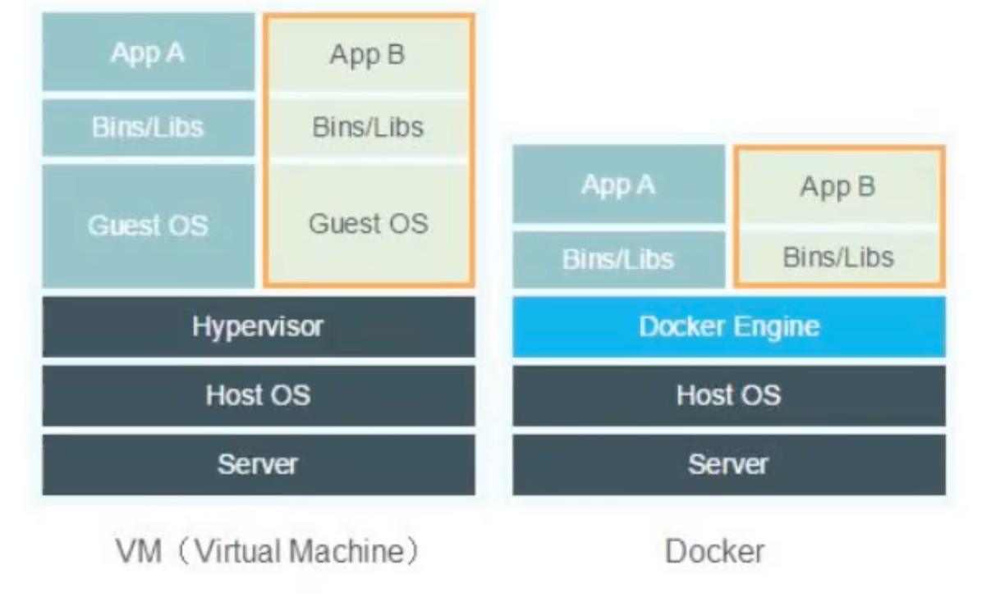

# 1、docker run之后发生了什么



## 举个例子

- docker run hello-world

```
root@gc-8440-01:/data/runzey# docker run hello-world
Unable to find image 'hello-world:latest' locally
latest: Pulling from library/hello-world
2db29710123e: Pull complete
Digest: sha256:4c5f3db4f8a54eb1e017c385f683a2de6e06f75be442dc32698c9bbe6c861edd
Status: Downloaded newer image for hello-world:latest

Hello from Docker!
This message shows that your installation appears to be working correctly.

To generate this message, Docker took the following steps:
 1. The Docker client contacted the Docker daemon.
 2. The Docker daemon pulled the "hello-world" image from the Docker Hub.
    (amd64)
 3. The Docker daemon created a new container from that image which runs the
    executable that produces the output you are currently reading.
 4. The Docker daemon streamed that output to the Docker client, which sent it
    to your terminal.

To try something more ambitious, you can run an Ubuntu container with:
 $ docker run -it ubuntu bash

Share images, automate workflows, and more with a free Docker ID:
 https://hub.docker.com/

For more examples and ideas, visit:
 https://docs.docker.com/get-started/
```

# 2、底层原理

## Docker是怎么工作的?

- 1.docker是一个Client-Server结构的系统,docker的守护进程运行在主机上面,通过Socket从客户端访问
- 2.DockerServer接收到Docker-client的命令,就会执行这个命令



## docker为什么比VM快

- 1.docker与VM相比有更少的抽象层
- 2.docker使用的是虚拟机的内核，VM需要GuestOS

 

- 3.所以说,新建一个容器的时候，docker不需要像vm一样重新加载一个OS内核,避免引导，虚拟机是加载guest OS,分钟级的,而docker是利用宿主机的操作系统,省略了这个复杂过程,秒级





# 学习完后所有的细节内容，再回过头来看这段理论，理解会更好一点